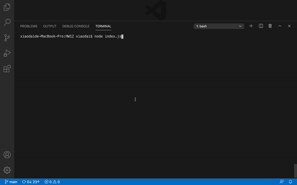

   

# 12.Employee Tracker

## Description
We had been learning how to use MySQL database to create our own database during the past week. This is the practice we use node to connect and interact with our database we create in MYSQL. I learn how to structure build the database in MySQL and use node to insert, delete and grab the information from database. It was challenge to get the info and insert it with the specific detail into database correctly. Over all I enjoy the process of seeing database is updated by the command I put in the node. 

## Usage

Demo:

 

## License
MIT 

## Badges

## Questions
        Please feel free to contact: 
        Github:https://github.com/anniechen9025/
        Email:anniechen9025@gmail.com